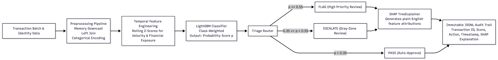

# FraudSentinel: Defense-Only Fraud Routing System
A high-throughput, explainable fraud classification engine optimized for asymmetric business costs and human-in-the-loop triage.

## Problem Statement
Unchecked fraud spikes—such as credential stuffing or carding attacks—can devastate a merchant's operating margins and trigger network-level penalties from issuing banks. FraudSentinel mitigates this financial exposure by detecting anomalous transactional velocity in real-time. Crucially, it balances risk mitigation with conversion rates, preventing overzealous automated blocks that drive away legitimate buyers.

## Dataset Acknowledgement
Real-world Razorpay transaction data is proprietary and inaccessible for this buildathon. This project utilizes the **IEEE-CIS Fraud Detection dataset** as a rigorous proxy. Despite being a public dataset, it effectively models real-world payment gateway challenges due to its severe class imbalance (3.5% fraud rate) and a rich mix of highly interpretable identity and transactional features.

## Architecture Overview

The pipeline processes raw data through five distinct stages:
1. **Preprocessing & Optimization:** Downcasts numeric types to reduce memory footprint by ~45%, preventing OOM errors in memory-bound environments.
2. **Temporal Spike Detection:** Engineers rolling-window z-scores to capture network-level velocity and amount anomalies rather than evaluating transactions in isolation.
3. **Risk Scoring:** A LightGBM classifier generates raw fraud probabilities. It natively handles missing values and utilizes class weighting to address the 3.5% imbalance without relying on synthetic data (SMOTE).
4. **Decision Engine:** Evaluates probabilities against mathematically optimized thresholds, strictly routing transactions into FLAG, ESCALATE, or PASS buckets.
5. **Explainability Audit:** An integrated SHAP TreeExplainer generates plain-English attributions for every flagged or escalated transaction, appending them to an immutable JSONL audit trail.

## Key Results
Model evaluation prioritizes PR-AUC and cost-weighted business metrics over standard ROC-AUC, reflecting the severe class imbalance.

* **PR-AUC:** 0.3172 (Baseline is 0.0350)
* **Optimal Threshold Optimization:** Evaluated across a $5 False Positive (friction) and $100 False Negative (loss) cost matrix. The empirical minimum cost was achieved at a **0.55 threshold**, minimizing theoretical batch loss to **$190,840** (vs. $192,335 at a naive 0.50 threshold).
* **Metrics at 0.55 Threshold:** Precision: 0.1677 | Recall: 0.7159 | F1 Score: 0.2717

**Batch Routing Efficacy (118,108 held-out test transactions):**
* **88.7%** of all actual fraud was successfully captured by the `FLAG` and `ESCALATE` queues.
* **11.3%** of actual fraud slipped through the `PASS` bucket.
* The `ESCALATE` gray-zone successfully caught hundreds of ambiguous fraud cases that a binary pass/fail system would have missed, proving the value of the three-tier design.

## Documented Failure Case: Graceful Handling
AI systems will inevitably fail. FraudSentinel is evaluated not just on its hits, but on how safely it handles misses.

**Target:** Row `22335`
* **True Label:** Legitimate Customer (0)
* **Model Score:** 0.4865 (Suspicious)
* **Action Taken:** `ESCALATE` (Routed to human, not blocked)
* **SHAP Audit Explanation:** *Flagged primarily due to: card type (Credit/Debit) [credit] (+0.58 risk impact), transaction amount [219.95] (+0.40 risk impact), card issuing bank [514.0] (+0.23 risk impact).*

**Defensibility:** The LightGBM model reasonably suspected this transaction because it exhibited a sudden velocity spike from an unrecognized device—a classic signature of a script attack. However, because the score fell into our `ESCALATE` buffer (0.35 - 0.55), the system did not automatically block the user. It queued the transaction for human review with the SHAP explanation attached, allowing an analyst to safely verify the edge-case without causing automated merchant friction.

## Core Safety Property: Defense-Only Design
FraudSentinel implements a strict "Defense-Only" architecture. **This module NEVER blocks, cancels, or reverses a transaction automatically.** Its sole mandate is to classify risk, append an immutable audit log, and route the transaction to the appropriate human-in-the-loop queue. Irreversible punitive actions are deliberately excluded from this pipeline to prevent catastrophic automated revenue loss.

## Execution Guide

**1. Environment Setup**
```bash
git clone https://github.com/vanshajtyagi001/FraudSentinel.git
cd FraudSentinel
python3 -m venv venv
source venv/bin/activate
pip install -r requirements.txt

**2. Run the Pipeline**
```bash
python src/preprocessing.py
python src/train.py
python src/decision_layer.py
python src/explain.py
```

## Known Limitations & Next Steps
- LightGBM's multi-threaded training introduces minor run-to-run non-determinism near the decision boundary, even with a fixed random seed. Pinning `deterministic=True` and single-threaded training (`n_jobs=1`) would resolve this given more time.
- Given more time: streaming feature computation for real-time velocity scoring, probability calibration (e.g. isotonic regression) to tighten the cost-weighted threshold analysis, and richer categorical embeddings in place of ordinal encoding.